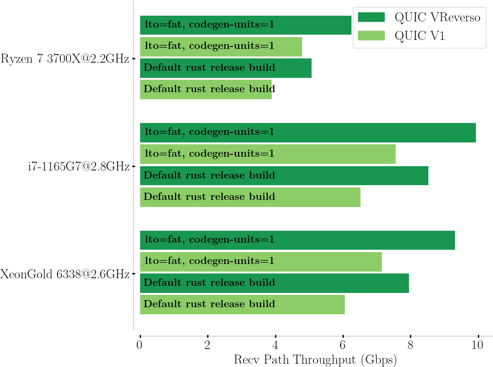

quiceh is a research implementation of QUIC VReverso, an extension of
the QUIC transport protocol which allows implementers to achieve higher
efficiency through the new opportunity to implement contiguous zero-copy
in the receive code path without touching the Crypto backend, which is
otherwise impossible with QUIC version 1 (RFC9000). This research
implementation is forked from Cloudflare's
[quiche](https://github.com/cloudflare/quiche) implementation of the
QUIC transport protocol. This repository is not aimed to compete with
the original implementation, which is qualitative and should be used
rather than this project. This repository serves as reference
implementation for an academic paper. However, interested Application
developers are welcome to try it and offer feebacks. 

Details on why/how QUIC VReverso implementations are expected to be more
efficient than QUIC V1 implementations can be read on the blogpost which
we made available through QUIC V1 and QUIC VReverso.  

(todo: under work)

Even more details are availbale in the academic paper, on .pdf:

[Reverso paper](https://arxiv.org/abs/2409.07138)

The most desirable outcome is that this proposal eventually makes it to
the official QUIC design, and QUIC implementations eventually take
advantage of the new efficiency possibilities. You're most welcome to
show support to this proposal in any way you feel is suitable. Thanks!

Efficiency improvement
----------------------

We report an improvement of ~30% over the receive code path.



Using quiceh
------------

### Overview of the main differences with [quiche](https://github.com/cloudflare/quiche)

quiceh has a few API extensions, and any application using
[quiche](https://github.com/cloudflare/quiche) would have to slightly
change its code to hopefully benefits from the optimizations. Of course,
these optimizations only work if the Application negotiates QUIC
VReverso with the peer.

```rust
let mut config = quiceh::Config::new(quiceh::PROTOCOL_VERSION_VREVERSO)?;
```

Using `PROTOCOL_VERSION_VREVERSO` which currently holds the temporary value 0x00791097 would make your endpoint tries to
negotiate VReverso first, and fallback to QUIC V1 if not available.
Client side or server side, the
[quiche](https://github.com/cloudflare/quiche) API to initiate a
connection stays the same:

```rust
// Client connection.
let conn = quiceh::connect(Some(&server_name), &scid, local, peer, &mut config)?;

// Server connection.
let conn = quiceh::accept(&scid, None, local, peer, &mut config)?;
```

We have slight differences in processing packets and reading data
from a stream. quiceh exposes a type `AppRecvBufMap` that aims to
contain the decrypted stream(s) data. This object needs to be created by
the Application, and a mutable reference is then passed to [`recv()`]
and [`stream_recv_v3()`]. Server-side, we need one of these for each
connection.

```rust
let to = socket.local_addr().unwrap();
let mut app_buffers = quiceh::AppRecvBufMap::default();

loop {
    let (len, from) = match socket.recv_from(&mut buf) {
        Ok(v) => v,

        Err(e) => {
            // There are no more UDP packets to read, so end the read
            // loop.
            if e.kind() == std::io::ErrorKind::WouldBlock {
                debug!("recv() would block");
                break;
            }

            panic!("recv() failed: {:?}", e);
        },
    };

    // One may either continue to drain the socket, or directly pass
    // the data to quiceh, as done here.

    let recv_info = quiceh::RecvInfo { from, to };

    let read = match conn.recv(&mut buf[..read], &mut app_buffers, recv_info) {
        Ok(v) => v,

        Err(e) => {
            // An error occurred, handle it.
            break;
        },
    };
}

// The application can check whether there are any readable streams by using
// the connection's [`readable()`] method, which returns an iterator over all
// the streams that have outstanding data to read.

if conn.is_established() {
    // Iterate over readable streams.
    for stream_id in conn.readable() {
        // Stream is readable, get a reference to the internal
        // contiguous stream data
        let (streambuf, len, fin) = conn.stream_recv_v3(stream_id, &mut app_buffers).unwrap();

        // ... do something with streambuf

        // Optionally mark some data consumed to release it.
        // If this function is not called, then the next stream_recv_v3
        // Would point to the same bytes, + any new content appended up
        // to a configured max_buffers_data (see AppRecvBufMap's API).

        conn.stream_consumed(stream_id, len, &mut app_buffers).unwrap();
    }
}
```

### Command-line apps

Here are a few examples on how to use the quiceh tools provided as part
of the [quiceh-apps](apps/) crate. This crate is an extension of the
[quiche-apps](https://github.com/cloudflare/quiche/tree/master/apps)
crate, supporting both QUIC VReverso and QUIC V1, as well as adding
recvmmsg() on the client and sendmmsg() on the server using the
[quinn-udp](https://github.com/quinn-rs/quinn/tree/main/quinn-udp)
crate.

After cloning the project according to the command mentioned in the
[building](#building) section, the client can be run as follows:

```bash
 $ cargo run --bin quiceh-client --wire-version 00791097 -- https://reverso.info.unamur.be:4433
```

Using `--wire-version 00791097` configures PROTOCOL_VERSION_VREVERSO.
If you want QUIC V1, you may use 00000001.

```bash
 $ cargo run --bin quiceh-server -- --cert apps/src/bin/cert.crt --key apps/src/bin/cert.key
```

(note that the certificate provided is self-signed and should not be used in
production).

Use the `--help` command-line flag to get a more detailed description of each
tool's options. If you'd like to make a straightforward test on the
loopback address, the following should work from the root of the
repository (after `cargo build --release`):

```bash
$ ./target/release/quiceh-server --key apps/src/bin/cert.key --cert apps/src/bin/cert.crt --root .
```

And using the client client to fetch the readme, with some logging
enabled on on stdout should print the README.md file on stdout with some
logging information for the connection:

```bash
$ RUST_LOG=info ./target/release/quiceh-client --wire-version 00791097 --no-verify https://127.0.0.1:4433/README.md
... <skip readme file>
[2024-05-02T11:44:40.893910677Z INFO  quiceh_apps::client] connecting to 127.0.0.1:4433 from 0.0.0.0:49803 with scid 97dcac3544c9e1f0d7a9d3e562c8e6c3e5bd03f9
[2024-05-02T11:44:40.907967338Z INFO  quiceh_apps::common] 1/1 response(s) received in 13.94742ms, closing...
[2024-05-02T11:44:40.919080924Z INFO  quiceh_apps::client] connection closed, recv=18 sent=11 lost=0 retrans=0 sent_bytes=2409 recv_bytes=15345 lost_bytes=0 [local_addr=0.0.0.0:49803 peer_addr=127.0.0.1:4433 validation_state=Validated active=true recv=18 sent=11 lost=0 retrans=0 rtt=1.325962ms min_rtt=Some(1.070281ms) rttvar=583.985µs cwnd=13500 sent_bytes=2409 recv_bytes=15345 lost_bytes=0 stream_retrans_bytes=0 pmtu=1350 delivery_rate=1328623]
```

### Advanced Configurations

The [`Config`] object controls important aspects of the QUIC connection such
as QUIC version, ALPN IDs, flow control, congestion control, idle timeout
and other properties or features.

QUIC is a general-purpose transport protocol and there are several
configuration properties where there is no reasonable default value. For
example, the permitted number of concurrent streams of any particular type
is dependent on the application running over QUIC, and other use-case
specific concerns.

quiceh defaults several properties to zero, applications most likely need
to set these to something else to satisfy their needs using the following:

- [`set_initial_max_streams_bidi()`]
- [`set_initial_max_streams_uni()`]
- [`set_initial_max_data()`]
- [`set_initial_max_stream_data_bidi_local()`]
- [`set_initial_max_stream_data_bidi_remote()`]
- [`set_initial_max_stream_data_uni()`]

[`Config`] also holds TLS configuration. This can be changed by mutators on
the an existing object, or by constructing a TLS context manually and
creating a configuration using [`with_boring_ssl_ctx_builder()`].

A configuration object can be shared among multiple connections.

The [`AppRecvBufMap`] should be instantiated passing info about the
chosen max_streams_bidi and max_streams_uni_remote. Each of the stream
buffers can also be configured with a max_buffers_data value. By
default, this value matches DEFAULT_STREAM_WINDOW, but the value can be
much higher. We advice chosing a value to the maximum length the
Application is expected to consume at once, such that all this
information can be buffered in zero-copy before being eventually
consumed.

### Generating outgoing packets

This aspect of [quiche](https://github.com/cloudflare/quiche) is
untouched at the API level. Outgoing packet are generated using the
connection's [`send()`] method:

```rust
loop {
    let (write, send_info) = match conn.send(&mut out) {
        Ok(v) => v,

        Err(quiceh::Error::Done) => {
            // Done writing.
            break;
        },

        Err(e) => {
            // An error occurred, handle it.
            break;
        },
    };

    socket.send_to(&out[..write], &send_info.to).unwrap();
}
```

When packets are sent, the application is responsible for maintaining a
timer to react to time-based connection events. The timer expiration can be
obtained using the connection's [`timeout()`] method.

```rust
let timeout = conn.timeout();
```

The application is responsible for providing a timer implementation, which
can be specific to the operating system or networking framework used. When
a timer expires, the connection's [`on_timeout()`] method should be called,
after which additional packets might need to be sent on the network:

```rust
// Timeout expired, handle it.
conn.on_timeout();

// Send more packets as needed after timeout.
loop {
    let (write, send_info) = match conn.send(&mut out) {
        Ok(v) => v,

        Err(quiceh::Error::Done) => {
            // Done writing.
            break;
        },

        Err(e) => {
            // An error occurred, handle it.
            break;
        },
    };

    socket.send_to(&out[..write], &send_info.to).unwrap();
}
```

#### Pacing

It is recommended that applications [pace] sending of outgoing packets to
avoid creating packet bursts that could cause short-term congestion and
losses in the network.

quiceh exposes pacing hints for outgoing packets through the [`at`] field
of the [`SendInfo`] structure that is returned by the [`send()`] method.
This field represents the time when a specific packet should be sent into
the network.

Applications can use these hints by artificially delaying the sending of
packets through platform-specific mechanisms (such as the [`SO_TXTIME`]
socket option on Linux), or custom methods (for example by using user-space
timers).

[pace]: https://datatracker.ietf.org/doc/html/rfc9002#section-7.7
[`SO_TXTIME`]: https://man7.org/linux/man-pages/man8/tc-etf.8.html

#### Sending stream data

After some back and forth, the connection will complete its handshake and
will be ready for sending or receiving application data.

Data can be sent on a stream by using the [`stream_send()`] method:

```rust
if conn.is_established() {
    // Handshake completed, send some data on stream 0.
    conn.stream_send(0, b"hello", true)?;
}
```

### HTTP/3

The quiceh [HTTP/3 module] provides a high level API for sending and
receiving HTTP requests and responses on top of the QUIC transport protocol.

Have a look at the [quiceh/examples/] directory for more complete examples on
how to use the quiceh API.

the directory apps/ contains a more complete implementation of a HTTP/3
client/server using the zero-copy HTTP/3 module.

The main differences with
[quiche](https://github.com/cloudflare/quiche)'s HTTP/3 module are the
use of [`poll_v3()`] replacing [`poll()`], [`recv_body_v3()`] replacing
[`recv_body()`] and the addition of [`body_consumed()`] to tell HTTP/3
how much of the data frame has been consumed (up to the announced max
value that [`recv_body_v3()`] announces.  Pretty much all the rest remains
the same.

[examples/]: quiceh/examples/


### Limitations

- FFIs for the VReverso are not (yet) implemented (please open an issue
  if this is desired).

Building
--------

quiceh requires Rust 1.66 or later to build. The latest stable Rust release can
be installed using [rustup](https://rustup.rs/).

Once the Rust build environment is setup, the quiceh source code can be fetched
using git:

```bash
 $ git clone --recursive git@github.com:frochet/quiceh
```

and then built using cargo:

```bash
 $ cargo build --examples
```

cargo can also be used to run the testsuite:

```bas
 $ cargo test
```

Note that [BoringSSL], which is used to implement QUIC's cryptographic handshake
based on TLS, needs to be built and linked to quiceh. This is done automatically
when building quiceh using cargo, but requires the `cmake` command to be
available during the build process. On Windows you also need
[NASM](https://www.nasm.us/). The [official BoringSSL
documentation](https://github.com/google/boringssl/blob/master/BUILDING.md) has
more details.

```bash
 $ QUICEH_BSSL_PATH="/path/to/boringssl" cargo build --examples
```
[BoringSSL]: https://boringssl.googlesource.com/boringssl/

Research
--------

- Commit "Towards Protocol Reverso" contains an example of
required work to support QUIC VReverso. It adds support for backwards
processing, for writing and parsing frames in the "reversed" order, and
unit tests for all QUIC features with these changes. 

- Commit "starting the work on Zerocopy receiver" contains an example of
  implementation taking advantage of the new protocol specification to
  support contiguous zero-copy.  

These two commits on the top of
[quiche](https://github.com/cloudflare/quiche) make up quiceh.  

If you use this code in your research, please cite the following paper:  

[Reverso](https://arxiv.org/abs/2409.07138) 

You may also cite this repository seperately:  

@misc{frochet-quiceh,  
&nbsp;&nbsp;title={quiceh: an implementation of QUIC VReverso},  
&nbsp;&nbsp;author={Florentin Rochet},  
&nbsp;&nbsp;howpublished={\url{https://github.com/frochet/quiceh}}  
}


Copyright
---------

Copyright (C) 2018-2019, Cloudflare, Inc.

See [COPYING] for the license.

[COPYING]: https://github.com/frochet/quiceh/tree/protocol_reverso/COPYING

[`Config`]: https://docs.rs/quiceh/latest/quiceh/struct.Config.html
[`AppRecvBufMap`]: https://docs.rs/quiceh/latest/quiceh/struct.AppRecvBufMap.html
[`recv`]: https://docs.rs/quiceh/latest/quiceh/struct.Connection.html#method.recv
[`stream_recv_v3`]: https://docs.rs/quiceh/latest/quiceh/struct.Connection.html#method.stream_recv_v3
[`set_initial_max_streams_bidi()`]: https://docs.rs/quiceh/latest/quiceh/struct.Config.html#method.set_initial_max_streams_bidi
[`set_initial_max_streams_uni()`]: https://docs.rs/quiceh/latest/quiceh/struct.Config.html#method.set_initial_max_streams_uni
[`set_initial_max_data()`]: https://docs.rs/quiceh/latest/quiceh/struct.Config.html#method.set_initial_max_data
[`set_initial_max_stream_data_bidi_local()`]: https://docs.rs/quiceh/latest/quiceh/struct.Config.html#method.set_initial_max_stream_data_bidi_local
[`set_initial_max_stream_data_bidi_remote()`]: https://docs.rs/quiceh/latest/quiceh/struct.Config.html#method.set_initial_max_stream_data_bidi_remote
[`set_initial_max_stream_data_uni()`]: https://docs.rs/quiceh/latest/quiceh/struct.Config.html#method.set_initial_max_stream_data_uni
[`with_boring_ssl_ctx_builder()`]: https://docs.rs/quiceh/latest/quiceh/struct.Config.html#method.with_boring_ssl_ctx_builder
[`send()`]: https://docs.rs/quiceh/latest/quiceh/struct.Connection.html#method.send
[`timeout()`]: https://docs.rs/quiceh/latest/quiceh/struct.Connection.html#method.timeout
[`on_timeout()`]: https://docs.rs/quiceh/latest/quiceh/struct.Connection.html#method.on_timeout
[`SendInfo`]: https://docs.rs/quiceh/latest/quiceh/struct.SendInfo.html
[`at`]: https://docs.rs/quiceh/latest/quiceh/struct.SendInfo.html#structfield.at
[`stream_send`]: https://docs.rs/quiceh/latest/quiceh/struct.Connection.html#method.steam_send
